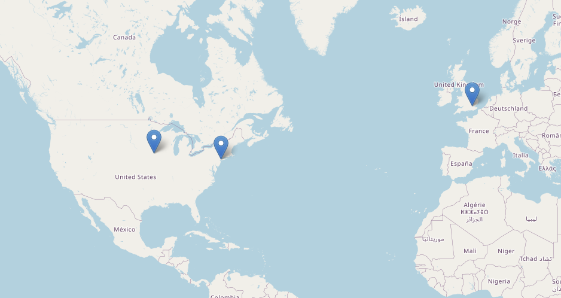

# OpenStreetMap - EZ-Map Generator
Given a list of locations formatted as ["{London, UK}", "{Ames, IA}", "{New York, NY}"], generate an OpenStreetMap pane (an HTML file that can potentially be embedded via an iframe) with pins at those locations.

## Example

### Input 
```
["{London, UK}", "{Ames, IA}", "{New York, NY}"]
```

### Output 
`map_with_pins.html`
