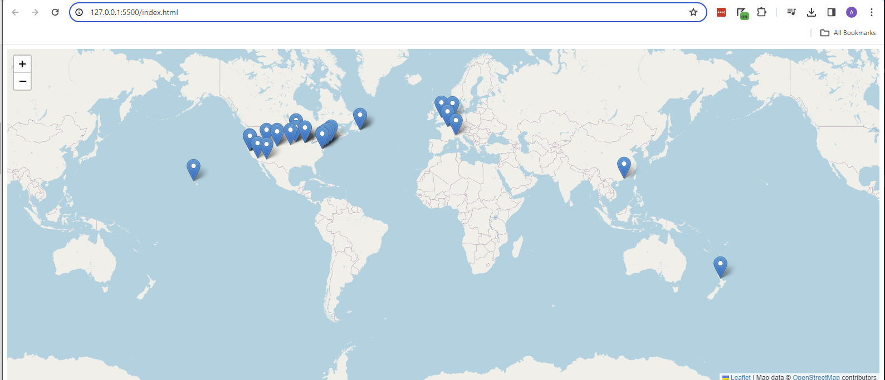

# OpenStreetMap - EZ-Map Generator
Given a list of locations formatted as ["{London, UK}", "{Ames, IA}", "{New York, NY}"], generate an OpenStreetMap pane (an HTML file that can potentially be embedded via an iframe) with pins at those locations.

## Example

### Input 
```
["{London, UK}", "{Ames, IA}", "{New York, NY}"]
```

### Output 
`map_with_pins.html`



### Info For John
Because of CORS limitations, I could not run this locally against your own data file so you'll need to uncomment the `//url = ... ` part and re-build to deploy to your own environment. 

1. Clone the repo: `git clone https://github.com/austinjhunt/openstreetmap-generator`
2. Install dependencies: `npm i`
3. Modify the [main.js](main.js) : uncomment the URL to your own data file:

``` 
//let url = "https://github.com/johndcobb/johndcobb.github.io/blob/master/_data/travel.yml"; // uncomment
let url = "http://127.0.0.1:5500/_data/travel.yml" // remove me
```
4. Create new production build with webpack: `npm run build`
5. Now you can deploy that new production `dist` folder (and the index.html with the map; this HTML is using the production JS) to your own GH Pages site. 